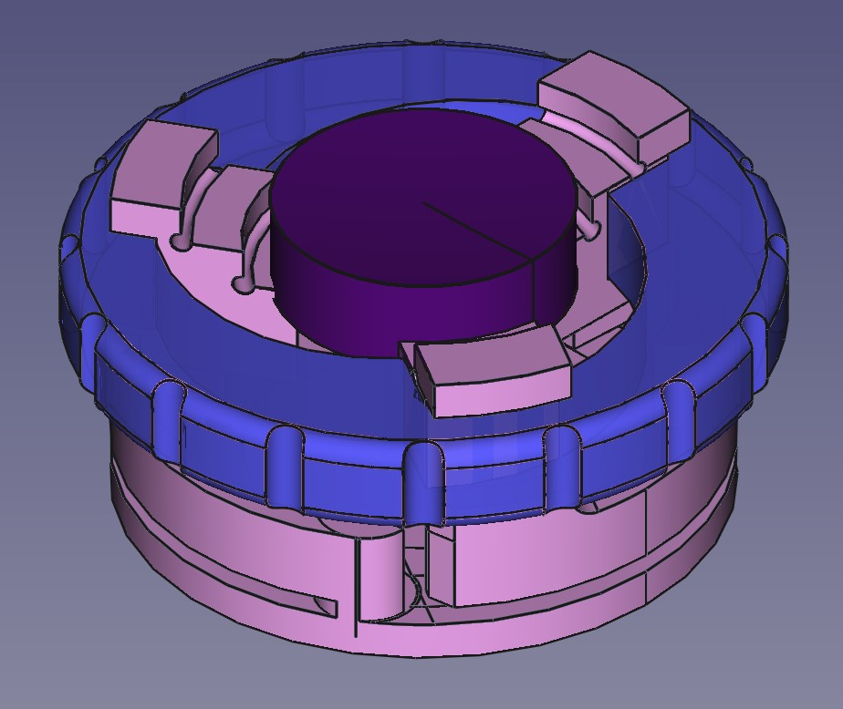

---

[

](http://www.echopen.org)

---

# echʘlab Chuck

This project explores the different ways to properly maintain all forms of transducers.

Find source files here : https://github.com/echopen-foundation/echolab_chuck

Find documentation here : https://github.com/echopen-foundation/echolab_chuck/wiki

---
